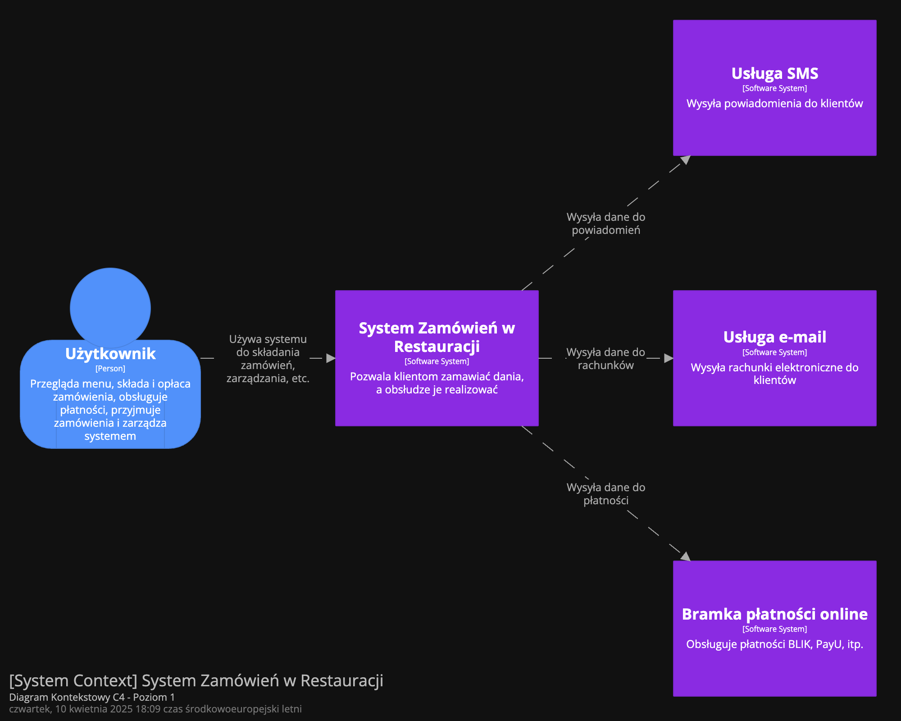

# Restaurant Ordering System


## Table of Contents

- [About the Project](#about-the-project)
- [System Context Diagram](#system-context-diagram)
- [Technology Stack](#technology-stack)
- [Features by User Role](#features-by-user-role)
- [Process Flow](#process-flow)
- [Microservice Architecture](#microservice-architecture)
- [Deployment & Setup](#deployment--setup)
- [License](#license)

## About the Project

**Restaurant Ordering System** is a cloud-ready, microservices-based application designed to digitize and automate the restaurant ordering process. The system enables:

- Customers to browse the menu, place and pay for orders via QR code.
- Waiters and kitchen staff to process orders with clear role-based interfaces.
- Managers to oversee operations, manage menus and monitor real-time order status.

This project emphasizes **clean service separation**, **asynchronous communication via RabbitMQ**, and modular architecture that can be deployed both locally (via Docker Compose) or on the cloud.

## System Context Diagram

<p align="center">
  
</p>

## Technology Stack

| Layer            | Technology           | Description                                           |
|------------------|----------------------|-------------------------------------------------------|
| **Backend**      | Python 3.11+, FastAPI | Async APIs with type-safe validation (Pydantic v2) |
| **ORM / DB**     | SQLAlchemy, PostgreSQL| Async database access for core services              |
| **Messaging**    | RabbitMQ              | Event-driven communication between services          |
| **Notifications**| AWS SNS              | External notifications (SMS, email)            |
| **Payments**     | PayU                 | Online payments with real-time order sync            |
| **API Gateway**  | Kong Gateway         | JWT auth, route forwarding, reverse proxy            |
| **Infrastructure**| Docker, Docker Compose | Local containerized setup                          |
| **Testing**      | Pytest, HTTPX        | Integration and unit tests for all services          |

## Features by User Role

### 1. Customer
- Scan QR code to start order
- Browse menu and add items
- Pay online or choose cash
- Track order status
- Cancel or give feedback before preparation

### 2. Waiter
- Accept and confirm cash orders
- Mark orders as delivered
- Handle ready-to-serve dishes

### 3. Chef
- View new paid orders
- Update status: preparing / ready
- Mark order as failed (e.g., out of stock)

### 4. Manager
- View all orders and user actions
- Manage menu items and staff roles
- Monitor activity in real time

## Process Flow

### 1. User Registration & Login
- New users register with email, name, phone, and password.
- Returning users log in to receive a JWT token.
- Required for placing and managing orders.

### 2. Ordering & Payment
- Customer scans QR code at the table.
- Selects dishes from the menu and reviews summary.
- Pays online (PayU) or selects cash.
- Upon successful payment, order is forwarded to the kitchen.

### 3. Order Fulfillment
- Chef receives order and marks it as "preparing" → "ready".
- Waiter delivers the order and marks it as "delivered".
- Customer gets notified (e.g., SMS via SNS) at each step.

### 4. Order Cancellation & Exceptions
- Customer can cancel before preparation starts.
- Chef can reject order due to unavailable ingredients.
- System handles refunds and updates status automatically.

## Microservice Architecture

The system follows a microservice-based design with strict service separation and internal communication over HTTP and RabbitMQ.

### Services Overview

- **api-gateway**  
  Acts as a reverse proxy and authentication layer (via Kong Gateway).

- **auth-service**  
  Handles user registration, login, JWT issuance, and role-based access.

- **order-service**  
  Manages order creation and status changes triggered by user actions.

- **staff-service**  
  Used by kitchen staff and waiters to process paid orders.

- **payment-service**  
  Integrates with external payment providers and triggers order updates.

- **notification-service**  
  Listens to events (via RabbitMQ), sends SNS notifications, and logs alerts.

### Communication

- **Sync (HTTP)** – Between gateway and internal services.
- **Async (RabbitMQ)** – For status changes, order events, and notifications.

## Deployment & Setup

Follow these steps to run the system locally using Docker:

### 1. Prerequisites
- Docker & Docker Compose installed
- Python 3.11+

### 2. Clone the Repository
```bash
git clone https://github.com/jonasz-lazar-pwr/restaurant-ordering-system.git
cd restaurant-ordering-system
```

### 3. Start the System
```bash
docker-compose up --build
```

This spins up all services: API Gateway (Kong), PostgreSQL, RabbitMQ, all microservices, and dependencies.

### 4. Access the System

| Component             | URL / Access                                  |
|-----------------------|-----------------------------------------------|
| Kong Admin API        | http://localhost:${KONG_GATEWAY_ADMIN_PORT}   |
| API Gateway (proxy)   | http://localhost:${KONG_GATEWAY_PORT}         |
| RabbitMQ Dashboard    | http://localhost:15672                        |
| PostgreSQL            | localhost:${DB_PORT} (via Docker service)     |
| Auth Service          | http://localhost:${AUTH_SERVICE_PORT}         |
| Order Service         | http://localhost:${ORDER_SERVICE_PORT}        |
| Staff Service         | http://localhost:${STAFF_SERVICE_PORT}        |
| Payment Service       | http://localhost:${PAYMENT_SERVICE_PORT}      |
| Notification Service  | http://localhost:${NOTIFICATION_SERVICE_PORT} |

### 5. Tear Down
Remove all containers, volumes, and networks.
```bash
docker-compose down -v
```

## License
This project is licensed under the terms of the MIT License. See the [LICENSE](./LICENSE) file for details.


